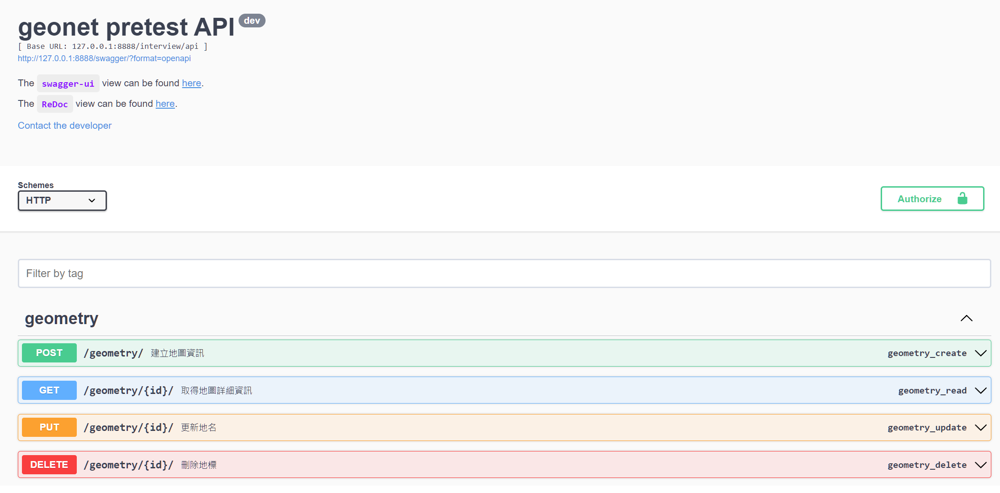

Geonet_pretest Deployment Guide
===============================

Prerequisites
-------------

Ensure that the following software is installed on your system:

* Docker
* Docker Compose

Deployment
------------

After cloning the repository, run the following command to start the application:

```bash
docker-compose up -d
```

The application will be available at http://localhost:8888

The swagger documentation will be available at http://localhost:8888/swagger/


